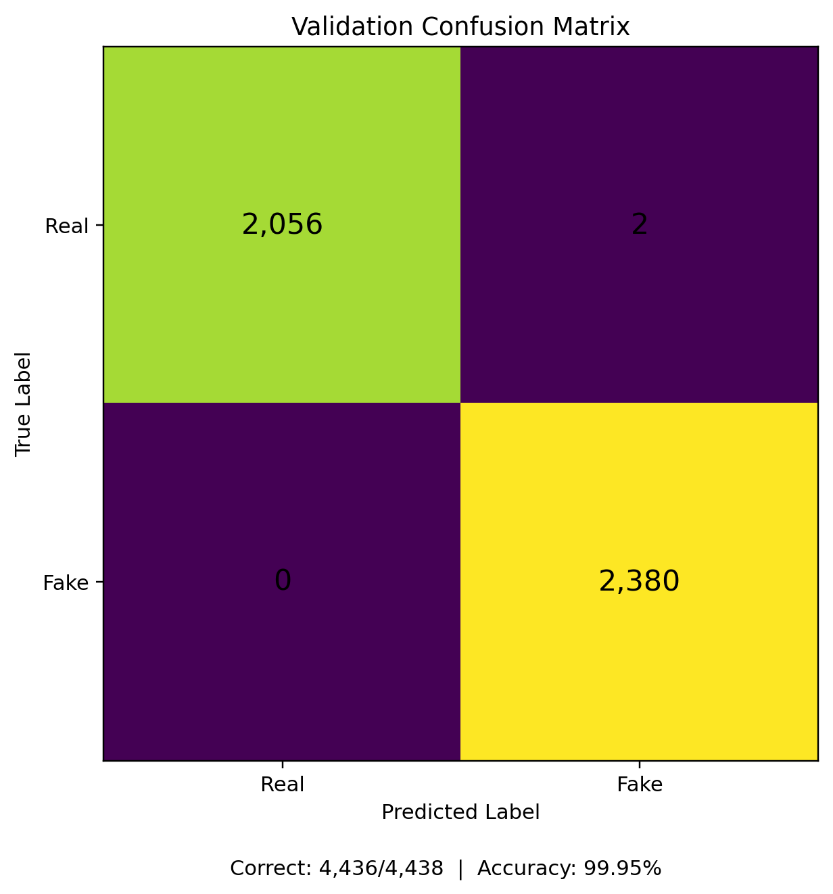

# Multimodal Deepfake Detection

Audio-visual deepfake detection using dual ResNet-18 feature extractors and cross-attention fusion on the FakeAVCeleb v1.2 dataset.

This project investigates whether inconsistencies between facial information and speech can be used to distinguish real from manipulated audio-video content. The pipeline processes video frames and audio separately, learns modality-specific representations, and fuses them with an audio-to-video cross-attention mechanism before binary classification.

## Project Overview

FakeAVCeleb contains four audio-video combinations:

- Real Video + Real Audio
- Fake Video + Real Audio
- Real Video + Fake Audio
- Fake Video + Fake Audio

For the binary task used in this project, samples are labeled according to whether the **audio is real or fake**:

| FakeAVCeleb category | Binary label |
|---|---|
| Real Video + Real Audio | Real |
| Fake Video + Real Audio | Real |
| Real Video + Fake Audio | Fake |
| Fake Video + Fake Audio | Fake |

The complete dataset scan identified **21,544 audio-video files**.

## Data Leakage Prevention

A key design decision was splitting the data at the **speaker level** rather than randomly splitting individual files.

An 80/20 speaker-disjoint split was used so that speaker identities appearing in training did not also appear in validation. This reduces the risk that the model simply memorizes recurring faces or voices instead of learning manipulation-related patterns.

## Preprocessing

### Video

Each source video is sampled at **10 uniformly spaced frames**. MTCNN detects and crops the face in each frame, producing tensors of size **160 × 160**. The preprocessing run successfully generated paired video tensors for **21,509 of 21,544 files**.

### Audio

Audio is extracted with FFmpeg as mono 16 kHz audio. Preprocessing creates fixed 8-second files, while the dataset loader later truncates or pads each waveform to **2 seconds (32,000 samples)** before feature extraction.

A Mel spectrogram is created using:

```python
torchaudio.transforms.MelSpectrogram(
    sample_rate=16000,
    n_mels=128,
    n_fft=1024,
    hop_length=512
)
```

The spectrogram is log-transformed and repeated across three channels so it can be processed by the standard ResNet-18 input layer.

## Model Architecture

The model uses two independent ResNet-18 backbones initialized with `weights=None`, so both branches are trained from scratch.

### Video branch

```text
10 face crops
      ↓
ResNet-18
      ↓
10 × 512 features
      ↓
Linear projection
      ↓
10 × 256 video features
```

All 10 projected frame features are retained as a sequence.

### Audio branch

```text
Log-Mel spectrogram
        ↓
ResNet-18
        ↓
512-dimensional feature
        ↓
Linear projection
        ↓
256-dimensional audio feature
```

### Cross-attention fusion

The audio representation is the **query**, while the 10 video representations provide the **keys and values**.

```python
nn.MultiheadAttention(
    embed_dim=256,
    num_heads=8,
    batch_first=True
)
```

The attended representation is passed through:

```text
Linear(256, 128)
↓
ReLU
↓
Dropout(0.3)
↓
Linear(128, 1)
```

The model outputs one logit. During inference, sigmoid probabilities and a 0.5 threshold are used for classification.

## Training

The original experiment used:

- `BCEWithLogitsLoss`
- Adam optimizer
- learning rate: `1e-4`
- batch size: `32`
- mixed precision training with PyTorch AMP
- up to 30 epochs
- best-checkpoint selection using validation F1 score

## Validation Results

The best saved model was evaluated on the speaker-disjoint validation set.

| Metric | Result |
|---|---:|
| Validation samples | 4,438 |
| Correct predictions | 4,436 |
| Accuracy | **99.95%** |
| Fake false negatives | **0** |
| Real false positives | **2** |

### Confusion Matrix

```text
                    Predicted
                  Real      Fake
Actual Real       2056         2
Actual Fake          0      2380
```



These results demonstrate extremely strong performance **within the FakeAVCeleb validation distribution** and should not be interpreted as 99.95% accuracy on arbitrary real-world deepfakes.

## External Testing and Domain Shift

The model was also tested qualitatively on five deepfake videos collected outside the training dataset.

Although internal validation performance was near perfect, the external videos exposed poor generalization: the model tended to classify unseen or compressed deepfake content as real with high confidence.

This highlights a key limitation of deepfake detection systems: strong in-distribution validation performance does not guarantee robustness to new manipulation methods, compression artifacts, or platform re-encoding.

Because this external test was qualitative and very small, no general-purpose external accuracy metric is reported.

## Repository Structure

```text
multimodal-deepfake-detection/
├── src/
│   ├── dataset.py
│   ├── preprocessing.py
│   ├── model.py
│   ├── train.py
│   └── evaluate.py
├── figures/
│   └── validation_confusion_matrix.png
├── presentation/
│   └── deepfake_detection_presentation.pdf
├── DATASET.md
├── RUNNING.md
├── requirements.txt
├── .gitignore
├── LICENSE
└── README.md
```

## Running the Project

Install dependencies:

```bash
pip install -r requirements.txt
```

Preprocess FakeAVCeleb:

```bash
python src/preprocessing.py \
  --dataset-root /path/to/FakeAVCeleb_v1.2 \
  --audio-out /path/to/processed_audio \
  --video-out /path/to/processed_video
```

Train the model:

```bash
python src/train.py \
  --audio-root /path/to/processed_audio \
  --video-root /path/to/processed_video \
  --output-dir artifacts
```

See `RUNNING.md` for additional details.

## Dataset

This repository does not redistribute FakeAVCeleb, processed audio files, face tensors, or model checkpoints.

See `DATASET.md` for the expected data structure and usage notes.

## Limitations

- Validation was performed within a single source dataset.
- The model was not evaluated on a large independent benchmark dataset.
- External testing consisted of only a small number of qualitative examples.
- Compression and unseen manipulation methods reduced model reliability.
- The binary label mapping in this implementation follows **audio authenticity**, so it should not be described as a universal detector of all possible video-only manipulation.
- Both ResNet-18 backbones were trained from scratch rather than initialized with pretrained ImageNet weights.

Future work could include cross-dataset evaluation, pretrained feature extractors, explicit unimodal baselines, compression augmentation, calibration analysis, and broader testing across manipulation techniques.

## Authors

- Ali Lalani
- Steve Elengical
- Weihao Huang

## Disclaimer

This project was developed for academic and research purposes. Deepfake detection performance is highly dependent on dataset construction and distribution. Results reported here are specific to the experimental setup described above.
