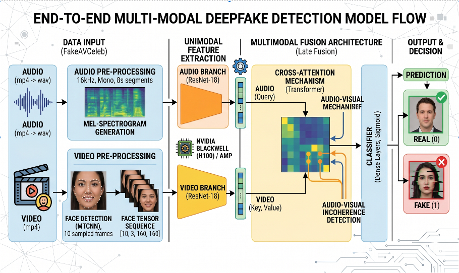
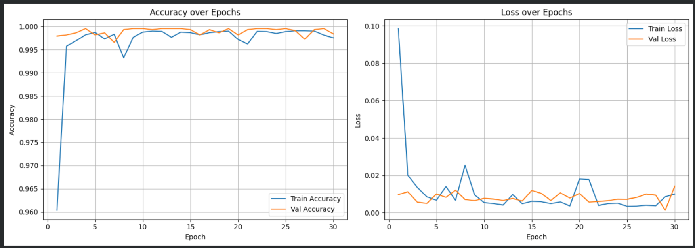

# Multimodal Deepfake Detection

Audio-visual deepfake detection using dual ResNet-18 feature extractors and cross-attention fusion on the FakeAVCeleb v1.2 dataset.

This project investigates whether inconsistencies between facial information and speech can be used to distinguish real from manipulated audio-video content. The pipeline processes video frames and audio separately, learns modality-specific representations, and fuses them with an audio-to-video cross-attention mechanism before binary classification.

## Model Architecture



The architecture consists of separate audio and video processing streams followed by multimodal fusion:

- **Video pathway:** 10 uniformly sampled frames are processed with MTCNN for face detection and passed through a ResNet-18 feature extractor.
- **Audio pathway:** audio is extracted at 16 kHz and converted into log-Mel spectrograms before being processed by a second ResNet-18.
- **Cross-attention:** the projected audio representation serves as the query, while the sequence of video-frame representations provides the keys and values.
- **Classification:** the attended multimodal representation is passed through a fully connected classification head to produce a real/fake prediction.

---

## Project Overview

FakeAVCeleb contains four audio-video combinations:

- Real Video + Real Audio
- Fake Video + Real Audio
- Real Video + Fake Audio
- Fake Video + Fake Audio

For the binary task used in this implementation, samples are labeled according to whether the **audio is real or fake**:

| FakeAVCeleb Category | Binary Label |
|---|---|
| Real Video + Real Audio | Real |
| Fake Video + Real Audio | Real |
| Real Video + Fake Audio | Fake |
| Fake Video + Fake Audio | Fake |

The complete dataset scan identified **21,544 audio-video files**.

---

## Data Leakage Prevention

A key design decision was splitting the dataset at the **speaker level** rather than randomly splitting individual videos.

An **80/20 speaker-disjoint split** was used so that speaker identities appearing in training did not also appear in validation.

This reduces the risk that the model learns to recognize recurring faces or voices rather than manipulation-related patterns.

The preprocessing pipeline also explicitly checks for speaker overlap between the training and validation partitions.

---

## Preprocessing

### Video Processing

Each source video is sampled at **10 uniformly spaced frames**.

For each sampled frame:

1. The frame is decoded using OpenCV.
2. The image is converted from BGR to RGB.
3. MTCNN detects and crops the face.
4. The resulting face tensor has a spatial size of **160 × 160**.
5. The 10 face tensors are stored together for model training.

The preprocessing pipeline successfully generated video tensors for **21,509 of 21,544 files**.

### Audio Processing

Audio is extracted from each video using FFmpeg and converted to:

- mono audio
- 16 kHz sample rate
- fixed 8-second files during preprocessing

During model loading, each waveform is truncated or padded to **2 seconds (32,000 samples)** before feature extraction.

A 128-bin Mel spectrogram is generated using:

```python
torchaudio.transforms.MelSpectrogram(
    sample_rate=16000,
    n_mels=128,
    n_fft=1024,
    hop_length=512
)
```

The spectrogram is log-transformed and repeated across three channels so it can be processed by the standard ResNet-18 input layer.

---

## Model Architecture Details

The model uses two independent **ResNet-18** backbones initialized with:

```python
weights=None
```

Both branches are therefore trained from scratch rather than initialized with pretrained ImageNet weights.

### Video Branch

The 10 detected face crops are processed independently through the video ResNet-18.

```text
10 Face Crops
      ↓
ResNet-18
      ↓
10 × 512 Features
      ↓
Linear Projection
      ↓
10 × 256 Video Features
```

Importantly, the 10 projected frame representations remain a **sequence** rather than being averaged together.

### Audio Branch

The log-Mel spectrogram is processed by a separate ResNet-18.

```text
Log-Mel Spectrogram
        ↓
ResNet-18
        ↓
512-dimensional Feature
        ↓
Linear Projection
        ↓
256-dimensional Audio Feature
```

### Cross-Attention Fusion

Multimodal fusion is performed using PyTorch's multi-head attention mechanism:

```python
nn.MultiheadAttention(
    embed_dim=256,
    num_heads=8,
    batch_first=True
)
```

The modalities are assigned as:

```text
Query  → Audio representation

Keys   → Video-frame representations

Values → Video-frame representations
```

The audio representation therefore attends over the sequence of 10 visual representations.

This produces a single **256-dimensional attended representation** containing information selected from the video sequence based on the audio representation.

### Classification Head

The fused representation is passed through:

```text
256-dimensional Attention Output
              ↓
       Linear(256, 128)
              ↓
             ReLU
              ↓
         Dropout(0.3)
              ↓
        Linear(128, 1)
              ↓
             Logit
```

During inference, the logit is converted to a probability using the sigmoid function.

A threshold of **0.5** is used for binary classification.

---

## Training

The experiment used:

- **Loss:** `BCEWithLogitsLoss`
- **Optimizer:** Adam
- **Learning rate:** `1e-4`
- **Batch size:** 32
- **Training duration:** up to 30 epochs
- **Mixed precision:** PyTorch AMP
- **Model selection:** validation F1 score

Model checkpoints and large processed artifacts are intentionally excluded from this repository.

### Training and Validation Performance



Training and validation accuracy remained consistently high after the initial epochs, while both loss curves stabilized at low levels throughout the 30-epoch training run.

The close relationship between training and validation performance indicates strong in-distribution performance on the speaker-disjoint FakeAVCeleb split.

---

## Validation Results

The best saved model was evaluated on the **speaker-disjoint validation set**.

| Metric | Result |
|---|---:|
| Validation samples | 4,438 |
| Correct predictions | 4,436 |
| Accuracy | **99.95%** |
| Fake false negatives | **0** |
| Real false positives | **2** |

### Confusion Matrix

```text
                    Predicted
                  Real      Fake
Actual Real       2056         2
Actual Fake          0      2380
```


The model correctly classified **4,436 of 4,438 validation samples**.

These results demonstrate extremely strong performance **within the FakeAVCeleb validation distribution**.

They should **not** be interpreted as evidence that the model achieves 99.95% accuracy on arbitrary real-world deepfake content.

---

## External Testing and Domain Shift

To examine performance beyond the training distribution, the model was also tested qualitatively on **five deepfake videos collected outside FakeAVCeleb**.

Despite the near-perfect internal validation results, the external videos exposed substantial generalization problems. The model frequently classified unseen or compressed deepfake content as real with high confidence.

This experiment highlights an important limitation of deepfake detection systems:

> Strong performance on an in-distribution validation set does not guarantee robustness to new manipulation techniques, compression artifacts, platform re-encoding, or other distribution shifts.

Because this external evaluation contained only a small number of examples and was not a controlled benchmark, no general-purpose external accuracy metric is reported.

---

## What This Project Demonstrates

This project implements an end-to-end multimodal deep learning workflow involving:

- processing **21,544 audio-video samples**
- speaker-level train/validation splitting
- automated face detection using MTCNN
- video frame sampling and tensor generation
- audio extraction using FFmpeg
- Mel-spectrogram feature generation
- dual ResNet-18 feature extraction
- dimensionality projection
- 8-head cross-attention multimodal fusion
- binary deep learning classification
- mixed-precision GPU training
- checkpoint selection using validation F1
- confusion-matrix evaluation
- out-of-distribution testing
- analysis of model generalization limitations

---

## Repository Structure

```text
multimodal-deepfake-detection/
│
├── src/
│   ├── dataset.py
│   ├── preprocessing.py
│   ├── model.py
│   ├── train.py
│   └── evaluate.py
│
├── figures/
│   ├── model_architecture.png
│   ├── training_validation_results.png
│   └── validation_confusion_matrix.png
│
├── presentation/
│   └── deepfake_detection_presentation.pdf
│
├── DATASET.md
├── RUNNING.md
├── requirements.txt
├── .gitignore
├── LICENSE
└── README.md
```

---

## Running the Project

### 1. Install Dependencies

```bash
pip install -r requirements.txt
```

### 2. Preprocess FakeAVCeleb

```bash
python src/preprocessing.py \
  --dataset-root /path/to/FakeAVCeleb_v1.2 \
  --audio-out /path/to/processed_audio \
  --video-out /path/to/processed_video
```

The preprocessing pipeline:

- creates the speaker-disjoint split
- extracts 16 kHz mono audio
- samples 10 video frames
- detects faces using MTCNN
- saves paired audio and video representations

### 3. Train the Model

```bash
python src/train.py \
  --audio-root /path/to/processed_audio \
  --video-root /path/to/processed_video \
  --output-dir artifacts
```

Model checkpoints and metric history are written to `artifacts/`, which is excluded from version control.

See [`RUNNING.md`](RUNNING.md) for additional details.

---

## Dataset

This project uses **FakeAVCeleb v1.2**.

The repository intentionally does **not** redistribute:

- raw FakeAVCeleb videos
- extracted WAV files
- processed face tensors
- trained model checkpoints

See [`DATASET.md`](DATASET.md) for dataset usage and expected directory structure.

Users should obtain FakeAVCeleb from its official source and review the dataset's licensing and usage requirements.

---

## Limitations

Several limitations should be considered when interpreting the results:

- Validation was performed within a single source dataset.
- The model was not evaluated on a large independent benchmark dataset.
- External testing consisted of only a small number of qualitative examples.
- Compression and previously unseen manipulation methods reduced model reliability.
- The current binary label mapping follows **audio authenticity**, meaning the implementation should not be interpreted as a universal detector of every possible video-only manipulation.
- Both ResNet-18 backbones were trained from scratch rather than initialized using pretrained ImageNet weights.

---

## Future Work

Potential improvements include:

- cross-dataset evaluation on additional deepfake benchmarks
- pretrained visual and audio feature extractors
- separate audio-only and video-only baseline models
- comparison of early, intermediate, and late multimodal fusion
- augmentation targeting compression and re-encoding artifacts
- probability calibration and confidence analysis
- broader testing across unseen manipulation techniques
- more systematic out-of-distribution evaluation

---

## Authors

- Ali Lalani
- Steve Elengical
- Weihao Huang

---

## Disclaimer

This project was developed for academic and research purposes.

Deepfake detection performance is highly dependent on dataset construction, manipulation methods, compression, and deployment conditions. Results reported here are specific to the experimental setup described above.
